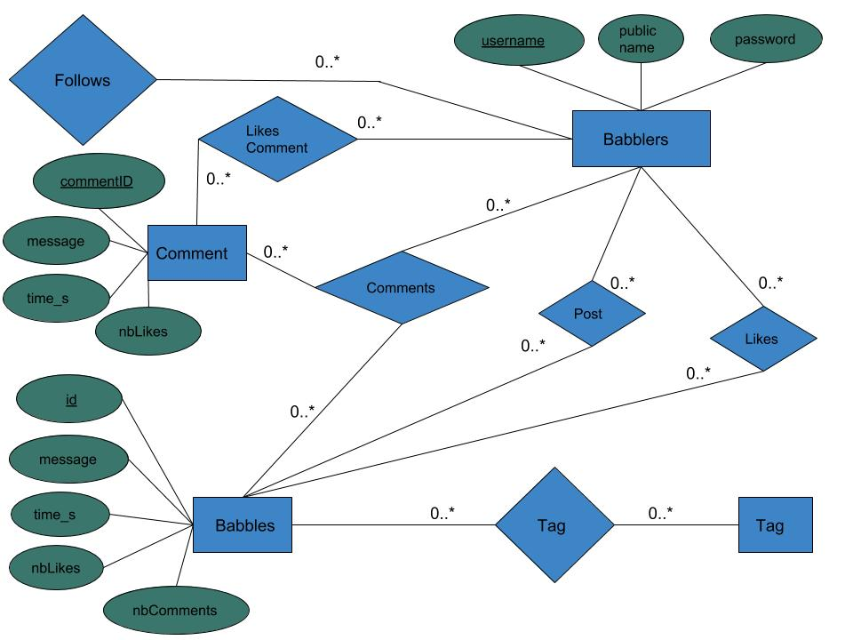

# Babbler
Homemade twitter-like web application

# Liens

[Rapport](https://drive.google.com/open?id=1lx70liwcA8EB2HQazvDFgBolvkQ33gXP)

[Déploiement Heroku](https://babbler-deploy.herokuapp.com)

# Installation

Sur la racine du projet, exécuter les commandes suivantes en ordre.

```bash
pip install virtualenv
virtualenv venv
source venv/bin/activate
pip install -r requirements.txt
mysql -u root -p < data/dump.sql
```

Par la suite, exécuter le fichier ```data/populate.py``` dans votre IDE. Celui-ci s'occupera d'ajouter des données au projet.

Finalement, il suffit de lancer l'application avec le fichier ```src/app.py```.

# Known problems
- Lors de l'exécution du projet, si la page d'accueil retourne une erreur 500, c'est parce qu'il faut configurer le sql_mode ainsi (cette action est normalement exécuté par le script ```dump.sql```):
```bash
STRICT_TRANS_TABLES,NO_ZERO_IN_DATE,NO_ZERO_DATE,ERROR_FOR_DIVISION_BY_ZERO,NO_AUTO_CREATE_USER,NO_ENGINE_SUBSTITUTION
```


# Diagramme entité relation
 
